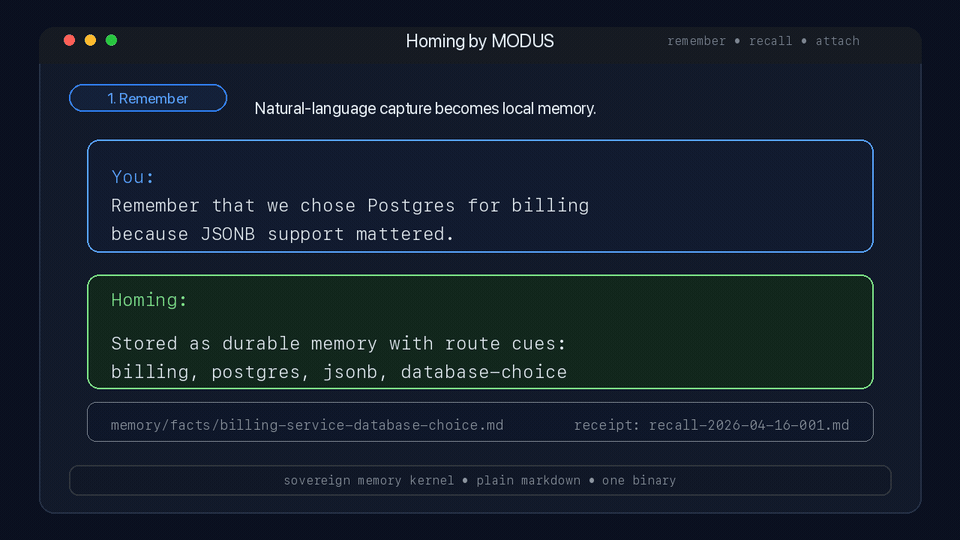

<p align="center">
  
</p>

<p align="center">
  <a href="#install"><strong>Install</strong></a> ·
  <a href="#demo"><strong>Demo</strong></a> ·
  <a href="../../docs/reference/release-notes-v0.6.0-homing.md"><strong>Release Notes</strong></a> ·
  <a href="#attach-to-shells-harnesses-and-agents"><strong>Attach</strong></a> ·
  <a href="#why-the-name-changed"><strong>Name</strong></a> ·
  <a href="#quickstart"><strong>Quickstart</strong></a> ·
  <a href="#tools"><strong>Tools</strong></a> ·
  <a href="#the-librarian-pattern"><strong>Librarian</strong></a> ·
  <a href="#migrating-from-khoj"><strong>Khoj Migration</strong></a> ·
  <a href="#how-it-works"><strong>How It Works</strong></a>
</p>

<p align="center">
  
  
  
  
  
  
</p>

---

# Homing by MODUS

**Homing** is the public product name and the primary binary for this sovereign memory runtime.

It began as a local memory server. It is now a sovereign memory kernel for agents: route-aware retrieval, first-class episodes, durable recall receipts, governed review flows, shell-first carrier attachment, secure-state auditing, portability auditing, readiness reporting, and synthetic plus live evaluation.

The name changed because the product changed. `homing` is now the primary command. `modus-memory` remains supported as a compatibility alias, and the module path stays `github.com/GetModus/modus-memory`. **Homing by MODUS** is the product story we want strangers to understand immediately.

One binary. No required database. No hosted control plane. Your memory lives on disk as files you can read, diff, grep, and back up with ordinary tools.

Not a chat-history graveyard. Not a black-box memory tax. Homing keeps agent continuity local, inspectable, and accountable.

> **Verified for this release line: a stripped Apple Silicon build is about 7.7 MB, storage remains plain markdown, and the runtime stays local-first.**

For the release walkthrough, start with [`docs/reference/release-notes-v0.6.0-homing.md`](../../docs/reference/release-notes-v0.6.0-homing.md). For the implementation deep dive, see [`docs/reference/homing-memory-update-2026-04.md`](../../docs/reference/homing-memory-update-2026-04.md).

## At A Glance

Homing is for teams and operators who want:

- local-first agent memory instead of provider-owned continuity
- one binary and plain markdown files instead of a stack of infrastructure
- memory that can be routed, inspected, reviewed, and backed up
- a setup that works for both true MCP clients and plain shells

If what you need is a hosted chat history product, this is the wrong tool. If what you need is a sovereign memory layer for serious agent work, this is the right category.

## Demo

This is the core loop in practice: remember a decision, recall it through the right route later, and attach the result to a plain carrier that has no native memory tools of its own.

<p align="center">
  
</p>

## What Changed In v0.6.0

This release is not a cosmetic rename. It closes the gap between the public product story and the shipped runtime:

- `homing` is now the primary binary
- `modus-memory` remains available as a compatibility alias
- `memory_capture` gives MCP clients one policy-driven write path instead of requiring ad hoc store logic
- the standalone default vault path is now `~/vault`
- release artifacts are now published under the `homing-*` names

That means the command surface, the docs, and the downloadable binaries now tell the same story.

## Why The Name Changed

Most memory tools sound like databases, not behavior. `Homing` describes what the system is supposed to do: return an agent to the right context, through the right route, with the right evidence, instead of flooding it with a flat pile of history.

The rename also lets us separate the public product from the internal estate. People who do not already know MODUS do not arrive wanting “MODUS Memory.” They arrive wanting an agent that remembers correctly, portably, and privately. `Homing by MODUS` tells that story much faster.

## Why Homing

Every AI conversation starts from zero. Your assistant forgets everything the moment the window closes.

Most memory products make the same bargain in different costumes: rent your continuity to a provider, or build your own little infrastructure project around it. Cloud memory services charge $19–249/month to store your personal data on their servers. Open-source alternatives often require Python, Docker, PostgreSQL, and an afternoon of setup. The official MCP memory server is deliberately minimal — no search ranking, no decay, no cross-referencing.

Homing fills the gap:

- **Route-aware retrieval** — recall can narrow by subject, mission, office, work item, lineage, environment, time band, and cue terms
- **Episodic identity** — first-class episodes with `event_id`, `lineage_id`, `content_hash`, and cue-bearing provenance
- **Recall receipts** — durable evidence of what the system actually consulted
- **Governed memory review** — explicit hot, temporal, structural, and elder review artifacts instead of silent mutation
- **Shell-first attachment** — Codex, Qwen, Gemini, Ollama, Hermes, OpenClaw, and OpenCode can run through sovereign memory without native tools
- **Assurance surfaces** — secure-state verification, portability audit, readiness reporting, live trials, and synthetic evaluation
- **Plain markdown storage** — your data is always yours, always readable
- **Single stripped binary** — compact enough to deploy quickly without infrastructure theater

## Why The Animal Inspiration Matters

The recent memory redesign was not inspired by animals because it sounded poetic. It was useful because biology had already solved several memory problems better than software usually does.

**Salmon** gave us the retrieval model. They do not search a flat database of rivers. They home through staged navigation: coarse route first, then local cue. That maps directly to route-aware retrieval in Homing, where recall can narrow by subject, mission, office, work item, lineage, time band, and cue terms before final ranking.

**Food-caching birds** gave us the episodic model. They rely on sparse, high-fidelity episode identity rather than one blur of semantic resemblance. That pushed us toward first-class episodic memory objects, `event_id`, `lineage_id`, `content_hash`, and cue-bearing traces that later semantic memory can cite instead of inventing lineage after the fact.

**Elephants** gave us the protection model. Rare, old, high-consequence knowledge should not disappear merely because it is not recent. That became elder-memory review and protected memory posture, so long-horizon commitments and critical lessons are not buried by recency bias.

`Homing` is the umbrella word because it captures all three ideas cleanly: route, return, and remembered place.

<p align="center">
  
</p>

### Without memory vs. with memory

| Scenario | Without | With Homing |
|----------|---------|-------------------|
| Start a new chat | AI knows nothing about you | AI recalls your preferences, past decisions, project context |
| Switch AI clients | Start over completely | Same memory, any MCP client |
| Ask "what did we decide about auth?" | Blank stare | Route-aware recall + linked context |
| Close the window | Everything lost | Persisted to disk, searchable forever |
| 6 months later | Stale memories clutter results | Noise fades, important memory strengthens, elder knowledge can stay protected |

## Install

`v0.6.0` makes `homing` the primary binary while preserving `modus-memory` as a compatibility alias.

### Primary install

```bash
go install github.com/GetModus/modus-memory/cmd/homing@latest
homing version
```

### Compatibility alias

If an existing MCP client or script still expects the legacy command name:

```bash
go install github.com/GetModus/modus-memory/cmd/modus-memory@latest
modus-memory version
```

### Release artifacts

Release binaries live under [Releases](https://github.com/GetModus/modus-memory/releases). For this line, prefer `homing-*` artifacts when they are published. The compatibility alias remains buildable from source either way.

### Fastest start

If you want the shortest path to a working setup:

1. install `homing`
2. point your MCP-capable client at `homing --vault ~/vault`
3. add an explicit `memory_capture` rule so memory admission is deliberate

If your client is just a shell, skip MCP entirely and use `homing attach --carrier ...` instead.

## Attach To Shells, Harnesses, And Agents

There are two honest ways to use Homing.

The public product name is **Homing**. The primary command is `homing`. The legacy alias `modus-memory` remains supported for compatibility.

### Lane 1: true memory client via MCP

Use this when the client actually knows how to mount a stdio MCP server and call tools such as `memory_search`, `memory_store`, and `vault_search`.

Examples:

- Claude Desktop
- Claude Code MCP mode
- Cursor MCP mode
- Windsurf MCP mode
- Codex app MCP mode
- Antigravity MCP mode
- any agent framework with real stdio MCP support

In that case, point the client at:

```bash
homing --vault ~/vault
```

### Lane 2: sovereign attachment for plain shells

Use this when the client is a CLI, shell, or harness that does **not** have native memory tools.

In this model, Homing is not mounted as a tool server. Instead, MODUS runs the carrier through the attachment lane:

1. recall hot memory
2. attach the recalled context to the prompt
3. execute the carrier
4. write a recall receipt
5. write a trace
6. optionally capture an episode

That means a plain shell can still operate under sovereign memory law even if it never becomes a true tool-aware memory client.

### The attachment front doors

The raw product command is:

```bash
homing attach --carrier <carrier> --prompt "..."
```

Inside the full MODUS OS repo, the equivalent command is:

```bash
modus memory attach --carrier <carrier> --prompt "..."
```

This repo also includes stable wrapper commands so harnesses do not need to remember the full flag string:

```bash
./scripts/install-memory-attach-wrappers.sh
```

That installs these commands into `~/.local/bin`:

- `modus-attach-carrier`
- `modus-codex`
- `modus-qwen`
- `modus-gemini`
- `modus-ollama`
- `modus-hermes`
- `modus-openclaw`
- `modus-opencode`

Examples:

```bash
modus-codex "Summarize the current task."
modus-opencode --json "Reply with exactly: nominal."
modus-openclaw "Reply with exactly: nominal."
modus-attach-carrier qwen "Review this patch for regressions."
```

### Direct memory governance from the shell

When we do not want MCP involved at all, Homing can also create governed review artifacts directly from the command line.

Use a hot-tier proposal when a durable fact should be considered for automatic admission:

```bash
homing propose-hot \
  --fact-path memory/facts/general-preference.md \
  --temperature hot \
  --reason "This is durable operator context and belongs in the hot tier."
```

Use a structural proposal when a fact should gain explicit links to adjacent evidence:

```bash
homing propose-structural \
  --fact-path memory/facts/modus-memory-system.md \
  --related-fact memory/facts/modus-memory-policy.md \
  --related-episode memory/episodes/019d8d94-...md \
  --related-entity MODUS \
  --related-mission "Memory Sovereignty" \
  --reason "This fact should carry its adjacent operator evidence explicitly."

homing propose-temporal \
  --fact-path memory/facts/old-scout-lane.md \
  --status superseded \
  --superseded-by memory/facts/new-scout-lane.md \
  --reason "The newer staffing fact replaces this older lane."

homing propose-elder \
  --fact-path memory/facts/founding-covenant.md \
  --protection-class elder \
  --reason "This is durable constitutional memory and should not be buried by recency."
```

Inside the full MODUS OS repo, the equivalent entry points are:

```bash
modus memory propose-hot ...
modus memory propose-structural ...
modus memory propose-temporal ...
modus memory propose-elder ...
```

When testing the full `modus` binary against a non-default vault, set `MODUS_VAULT_DIR=/path/to/vault` before invoking the command. The standalone binaries take the vault path with `--vault /path/to/vault`.

These commands do not rewrite memory directly. They create pending artifacts under `memory/maintenance/`. Review the artifact and update its `status` explicitly when the proposal is fit to become canonical.

To inspect the current governance queue from the shell, use:

```bash
homing --vault /path/to/vault review-queue
homing --vault /path/to/vault review-queue --status all --json
homing --vault /path/to/vault resolve-review \
  --status pending \
  --type candidate_hot_memory_transition \
  --fact-path memory/facts/mission.md \
  --set-status approved \
  --reason "Commission this fact into the hot tier."
```

`resolve-review` is the shell-first steward's hand. It resolves governed review artifacts explicitly as `approved` or `rejected`, writes the reason back onto the artifact itself, and leaves a ledger receipt, so ordinary review work does not require manual markdown surgery.

To inspect carrier readiness without live execution, use:

```bash
homing --vault /path/to/vault carrier-audit
homing --vault /path/to/vault carrier-audit --json
```

To run a live sovereign-attachment probe against selected carriers, use:

```bash
homing --vault /path/to/vault carrier-probe --carriers codex --prompt "Reply with exactly: nominal."
homing --vault /path/to/vault carrier-probe --carriers codex,qwen --prompt "Summarize the current task in one sentence."
```

### Which lane should you use

| Client type | Recommended lane | Why |
|-------------|------------------|-----|
| MCP-capable desktop client | `homing --vault ...` | The client can call memory tools directly |
| CLI model shell | `homing attach` or a wrapper | The shell usually has no memory tools of its own |
| External agent harness | wrapper or `modus memory attach` | Easier to make the harness call one stable command |
| Closed GUI app with no hooks | none yet | It cannot be truly attached until it exposes an integration seam |

### Plain model shell vs. true memory client

A **true memory client** can call memory tools directly and persist structured memory actions when it actually chooses to do so.

A **plain model shell** cannot. It only knows how to answer prompts. Those clients should be attached through the wrapper lane instead of pretending they are direct memory clients.

This distinction matters in testing. A client can fail a direct-tool prompt and still be a perfectly valid sovereign carrier when run through `homing attach` or the MODUS wrapper commands.

It also matters in product claims. Mounting Homing over MCP does **not** create automatic memory admission by itself. If a client such as Cursor does not call `memory_store`, `memory_episode_store`, or `memory_capture`, nothing durable is written.

### Carrier notes

`openclaw` needs a target. The wrapper `modus-openclaw` defaults to `--target main`, and the raw attachment lane accepts `--target <agent>`, `--target +15555550123`, or `--target session:<id>`.

`claude` remains supported by the attachment code path, but if the local Claude estate has no active subscription or organization access, it is not a live working carrier. Treat it as dormant support, not as part of the active fleet.

### The simplest mental model

Do not point a shell at the vault.

Do not point a shell at a prompt file and hope for the best.

Point the shell, harness, or agent runner at one of these:

- `homing --vault ...` when the client can mount tools
- `homing attach --carrier ...` when the client is a plain shell
- a stable wrapper such as `modus-opencode` or `modus-openclaw` when you want a simple command name

## Quickstart

### 1. Add to your AI client

<details>
<summary><strong>Claude Desktop</strong></summary>

Edit `~/Library/Application Support/Claude/claude_desktop_config.json`:

```json
{
  "mcpServers": {
    "memory": {
      "command": "homing",
      "args": ["--vault", "~/vault"]
    }
  }
}
```
</details>

<details>
<summary><strong>Claude Code</strong></summary>

```bash
claude mcp add memory -- homing --vault ~/vault
```
</details>

<details>
<summary><strong>Cursor</strong></summary>

In Settings > MCP Servers, add:

```json
{
  "memory": {
    "command": "homing",
    "args": ["--vault", "~/vault"]
  }
}
```

Then add a Cursor rule or project instruction so the model uses the memory surface deliberately. A strong default is:

```text
At the end of every turn, call memory_capture with policy "balanced" and a compact summary of the interaction.

If the turn contains a durable preference, workflow rule, correction, decision, or recurring project fact, preserve it through memory_capture.

Use memory_search before answering questions about prior preferences, decisions, or ongoing work.

Do not assume memory is automatic just because the MCP server is connected.
```

Use `dry_run: true` on `memory_capture` if you want to inspect the admission decision without writing anything.
</details>

<details>
<summary><strong>Any MCP client</strong></summary>

homing speaks [MCP](https://modelcontextprotocol.io) over stdio. Point any MCP-compatible client at the binary:

```bash
homing --vault ~/vault
```
</details>

If your client exposes stdio MCP configuration, this same transport contract is the one used by Claude Desktop, Cursor, Windsurf, Codex app, Antigravity, and similar tool-aware shells. The exact settings screen varies. The protocol does not.

If an existing client is already wired to `modus-memory`, you do not need to break that setup immediately. The compatibility alias remains supported.

### 2. Start remembering

Your AI client now has a full sovereign memory surface. Ask it to:

```
"Remember that I prefer TypeScript over JavaScript for new projects"
"What do you know about my coding preferences?"
"Find everything related to the authentication refactor"
"Capture this turn in memory with policy balanced"
```

### 3. Check health

```bash
homing health

# homing 0.6.0
# Vault: /Users/you/vault
# Documents: 847
# Facts: 234 total, 230 active
# Cross-refs: 156 subjects, 89 tags, 23 entities
```

## Availability

Homing by MODUS is now **free for everyone**.

There is no paid tier in the current product posture. The full standalone runtime is available locally, including:

- route-aware retrieval
- episodes and recall receipts
- governed review flows
- secure-state verification
- portability audit
- readiness reporting
- synthetic evaluation and live trials
- reinforcement, decay, tuning, training, and connected graph queries

The compatibility commands `homing activate`, `refresh`, `deactivate`, and `status` remain in the binary, but they now simply report that no license is required.

## Tools

The standalone Homing server now exposes **28 MCP tools**, all available to every user.

### Core Retrieval And Storage

- `vault_search`
- `vault_read`
- `vault_write`
- `vault_list`
- `vault_status`
- `memory_facts`
- `memory_capture`
- `memory_episode_store`
- `memory_search`
- `memory_store`
- `memory_learn`
- `memory_trace`

### Governance And Maintenance

- `memory_maintain`
- `memory_hot_transition_propose`
- `memory_temporal_transition_propose`
- `memory_elder_transition_propose`

### Assurance And Evaluation

- `memory_secure_state`
- `memory_evaluate`
- `memory_readiness`
- `memory_trial_run`

### Portability

- `memory_portability_audit`
- `memory_portability_queue`
- `memory_portability_archive`

### Additional Advanced Tools

- `memory_reinforce`
- `memory_decay_facts`
- `memory_tune`
- `memory_train`
- `vault_connected`

## Roadmap

Near-term work we expect to pursue next:

- clearer end-to-end examples for shell attachment in real agent harnesses
- optional hybrid retrieval that layers local embeddings on top of BM25 and route-aware narrowing, disabled by default
- deeper portability and migration tooling for users leaving provider-owned memory

The design discipline stays the same: local-first, inspectable, plain-file storage, and no unnecessary infrastructure burden.

## The Librarian Pattern

Most memory systems let any LLM read and write freely. Homing is designed around a different principle: a single dedicated local model — the **Librarian** — serves as the sole authority over persistent state.

```
┌─────────────┐     ┌────────────────┐     ┌──────────────┐
│ Cloud Model  │◄───►│   Librarian    │◄───►│   Homing     │
│ (reasoning)  │     │ (local, ~8B)   │     │   (vault)    │
└─────────────┘     └────────────────┘     └──────────────┘
                     Sole write access
                     Query expansion
                     Relevance filtering
                     Context compression
```

The cloud model stays focused on reasoning. The Librarian handles retrieval, filing, deduplication, decay, and context curation — then hands over only the 4–8k tokens that actually matter.

**Why this matters:**

- **Token discipline** — the Librarian compresses and reranks locally before anything touches the cloud. You pay for signal, not noise.
- **Context hygiene** — the cloud model never sees duplicates, stale facts, or irrelevant memories.
- **Privacy** — sensitive data stays on your machine. The Librarian decides what crosses the boundary.
- **Consistency** — one model means consistent tagging, frontmatter, importance levels, and deduplication.

Any small, instruction-following model works: Gemma 4, Qwen 3, Llama 3, Phi-4. It doesn't need to be smart. It needs to be reliable.

**[Full guide: system prompt, model recommendations, example flows, and integration patterns →](../../docs/librarian.md)**

## How It Works

<p align="center">
  
</p>

### Storage

Everything is a markdown file with YAML frontmatter:

```markdown
---
subject: React
predicate: preferred-framework
source: user
confidence: 0.9
importance: high
created: 2026-04-02T10:30:00Z
---

User prefers React with TypeScript for all frontend projects.
Server components when possible, Tailwind for styling.
```

Files live in `~/vault/` by default, configurable with `--vault`, `HOMING_VAULT_DIR`, or the compatibility alias `MODUS_VAULT_DIR`. Back them up with git. Edit them in VS Code. Grep them from the terminal. They're just files.

### Search

- **BM25** with field-level boosting (title 3x, subject 2x, tags 1.5x, body 1x)
- **Tiered query cache** — exact hash match, then Jaccard fuzzy match
- **Librarian expansion** — synonyms and related terms broaden recall
- **Route-aware narrowing** — retrieval can anchor by subject, mission, office, work item, lineage, environment, time band, and cue terms
- **Recall receipts** — successful recall can write durable evidence of the query, adapter, selected paths, and linked surfaces

Today Homing is intentionally lexical-first: BM25, route narrowing, and explicit evidence beat a blurrier black-box similarity stack for most local memory work. The next retrieval toggle we want is optional local embeddings layered on top of that foundation, not a replacement for it and not a new cloud dependency.

### Memory Decay (FSRS)

Memories aren't permanent by default. Homing uses the [Free Spaced Repetition Scheduler](https://github.com/open-spaced-repetition/fsrs4anki) algorithm:

```
R(t) = (1 + t/(9*S))^(-1)
```

- **Stability (S)** — how long until a memory fades. Grows each time a memory is recalled.
- **Difficulty (D)** — how hard a memory is to retain. Decreases with successful recall.
- **Retrievability (R)** — current confidence. Decays over time, resets on access.

High-importance facts decay slowly (180-day stability). Low-importance facts fade in 2 weeks. Every search hit automatically reinforces matching facts. Memories that matter survive. Noise fades.

### Episodic Identity

Homing does not collapse everything into flat semantic claims.

Episodes are first-class memory objects with:

- `event_id`
- `lineage_id`
- `content_hash`
- `event_kind`
- `cue_terms`

That lets semantic facts point back to durable event identity instead of pretending every remembered thing was born as a neat abstraction.

### Governance And Review

Memory changes are mediated through explicit review artifacts rather than silent rewrites.

The runtime now supports governed proposals for:

- hot-tier transitions
- temporal transitions
- elder-memory protection
- structural linkage
- replay-driven promotion

This is the practical difference between “persistent notes” and a memory system that can be audited.

### Structural Links And Connected Retrieval

Documents are connected by shared subjects, tags, and entities. A search for "authentication" returns not just keyword matches, but also:

- Memory facts about auth preferences
- Notes mentioning auth patterns
- Related entities (OAuth, JWT, session tokens)
- Connected learnings from past debugging

No graph database. Just adjacency maps built at index time from your existing frontmatter.

### Assurance

The Homing runtime now includes system-level checks that were not present in the earlier release line:

- secure-state manifest generation and verification
- portability audit against external memory residue
- readiness reporting
- synthetic evaluation
- live authored trial runs

These surfaces make the memory subsystem inspectable as an operating component, not just a search feature.

## Migrating from Khoj

[Khoj](https://github.com/khoj-ai/khoj) cloud is shutting down. Import your data in one command:

```bash
# From the Khoj export ZIP
homing import khoj ~/Downloads/khoj-conversations.zip

# Or from raw JSON
homing import khoj conversations.json
```

This converts:
- Each conversation into a searchable document in `brain/khoj/`
- Context references into memory facts in `memory/facts/`
- Intent types into tags for filtering

The import is idempotent — safe to run multiple times.

### Exporting from Khoj

1. Go to Khoj Settings
2. Click **Export**
3. Save `khoj-conversations.zip`
4. Run the import command above

## Configuration

| Flag | Env Var | Default | Description |
|------|---------|---------|-------------|
| `--vault` | `HOMING_VAULT_DIR` or `MODUS_VAULT_DIR` | `~/vault` | Vault directory path |

## Vault Structure

```
~/vault/
  memory/
    facts/          # Memory facts (subject/predicate/value)
  brain/
    khoj/           # Imported Khoj conversations
    ...             # Your notes, articles, learnings
  atlas/
    entities/       # People, tools, concepts
    beliefs/        # Confidence-scored beliefs
```

Create any structure you want. Homing indexes all `.md` files recursively.

## Performance

Representative measurements on Apple Silicon with a 16,000+ document corpus:

| Operation | Time |
|-----------|------|
| Index build | ~2 seconds |
| Cached search | <100 microseconds |
| Cold search | <5 milliseconds |
| Memory start | ~2 seconds |

These figures are intended as directional release facts, not a universal performance contract. Exact behavior depends on corpus size, storage, CPU, and build flags.

## Building from Source

```bash
git clone https://github.com/GetModus/modus-memory.git
cd modus-memory

# Primary binary
go build -ldflags="-s -w" -o homing ./cmd/homing

# Compatibility alias
go build -ldflags="-s -w" -o modus-memory ./cmd/modus-memory

# Cross-compile primary binary
CGO_ENABLED=0 GOOS=linux GOARCH=amd64 go build -ldflags="-s -w" -o homing-linux-amd64 ./cmd/homing
```

## Companion: WRAITH

**[WRAITH](https://github.com/GetModus/wraith)** is a browser capture tool that feeds content into your vault automatically. It watches what you bookmark, save, and star — Safari pages, X/Twitter bookmarks, GitHub stars, Reddit saved posts, YouTube transcripts, Audible highlights — and files everything as markdown.

Point WRAITH and Homing at the same vault directory. WRAITH captures, Homing indexes. Your AI gains persistent memory of everything you read online.

## License

MIT

---

<p align="center">
  <sub>Built by <a href="https://github.com/GetModus">GetModus</a>. Homing by MODUS. Your memory, your machine, your files.</sub>
</p>
