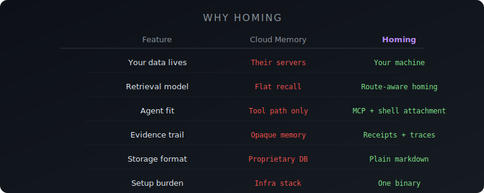
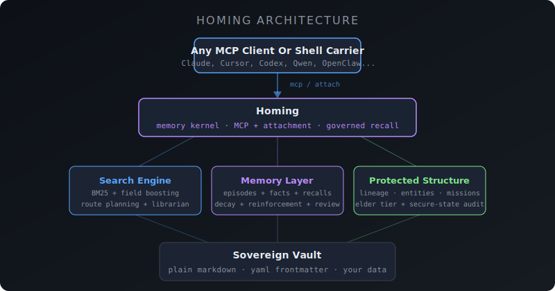

<p align="center">
  
</p>

<p align="center">
  <a href="#install"><strong>Install</strong></a> ·
  <a href="#attach-to-shells-harnesses-and-agents"><strong>Attach</strong></a> ·
  <a href="#why-the-name-changed"><strong>Name</strong></a> ·
  <a href="#quickstart"><strong>Quickstart</strong></a> ·
  <a href="#tools"><strong>Tools</strong></a> ·
  <a href="#the-librarian-pattern"><strong>Librarian</strong></a> ·
  <a href="#migrating-from-khoj"><strong>Khoj Migration</strong></a> ·
  <a href="#how-it-works"><strong>How It Works</strong></a>
</p>

<p align="center">
  
  
  
  
  
</p>

---

# Homing by MODUS

**Homing** is the public name for the product currently shipped as `modus-memory`.

We built it under a literal name because that was the honest description at the start: a local memory server. Over the last several sessions it became something more specific and more ambitious: a sovereign memory kernel for agents, with route-aware retrieval, episodic identity, recall receipts, governed hot memory, portability auditing, and a shell-first attachment lane for clients that do not expose native memory tools.

So the name changed because the product changed. `modus-memory` is still the current binary, package, and release name while packaging and docs catch up. **Homing** is the story we actually want strangers to hear.

One binary. No cloud. No Docker. No database. Your memory stays on your disk as files you can read, edit, grep, and back up with git.

Not a chat-history graveyard. Not a black-box memory tax. Homing keeps agent continuity local, inspectable, and accountable.

> **16,000+ documents indexed in ~2 seconds. Cached searches in <100 microseconds. ~6MB binary. Zero runtime dependencies.**

If you want the release-quality walkthrough of what changed, what improved, what was fixed, and how to set the system up, start with [`docs/reference/homing-memory-update-2026-04.md`](../../docs/reference/homing-memory-update-2026-04.md).

## Why The Name Changed

Most memory tools sound like databases, not behavior. `Homing` describes what the system is supposed to do: return an agent to the right context, through the right route, with the right evidence, instead of flooding it with a flat pile of history.

The rename also lets us separate the public product from the internal estate. People who do not already know MODUS do not arrive wanting “MODUS Memory.” They arrive wanting an agent that remembers correctly, portably, and privately. `Homing by MODUS` tells that story much faster.

## Why Homing

Every AI conversation starts from zero. Your assistant forgets everything the moment the window closes.

Most memory products make the same bargain in different costumes: rent your continuity to a provider, or build your own little infrastructure project around it. Cloud memory services charge $19–249/month to store your personal data on their servers. Open-source alternatives often require Python, Docker, PostgreSQL, and an afternoon of setup. The official MCP memory server is deliberately minimal — no search ranking, no decay, no cross-referencing.

Homing fills the gap:

- **BM25 full-text search** with field boosting and query caching
- **FSRS spaced repetition** — memories decay naturally, strengthen on recall
- **Cross-referencing** — facts, notes, and entities linked by subject and tag
- **Route-aware retrieval** — subject, mission, work item, office, lineage, cue terms
- **Episodic identity + recall receipts** — evidence for what happened and what was actually consulted
- **Librarian query expansion** — "React hooks" can also find "useState lifecycle"
- **Plain markdown storage** — your data is always yours, always readable
- **~6MB binary** — download, configure, done

## Why The Animal Inspiration Matters

The recent memory redesign was not inspired by animals because it sounded poetic. It was useful because biology had already solved several memory problems better than software usually does.

**Salmon** gave us the retrieval model. They do not search a flat database of rivers. They home through staged navigation: coarse route first, then local cue. That maps directly to route-aware retrieval in Homing, where recall can narrow by subject, mission, office, work item, lineage, time band, and cue terms before final ranking.

**Food-caching birds** gave us the episodic model. They rely on sparse, high-fidelity episode identity rather than one blur of semantic resemblance. That pushed us toward first-class episodic memory objects, `event_id`, `lineage_id`, `content_hash`, and cue-bearing traces that later semantic memory can cite instead of inventing lineage after the fact.

**Elephants** gave us the protection model. Rare, old, high-consequence knowledge should not disappear merely because it is not recent. That became elder-memory review and protected memory posture, so long-horizon commitments and critical lessons are not buried by recency bias.

`Homing` is the umbrella word because it captures all three ideas cleanly: route, return, and remembered place.

<p align="center">
  
</p>

### Without memory vs. with memory

| Scenario | Without | With Homing |
|----------|---------|-------------------|
| Start a new chat | AI knows nothing about you | AI recalls your preferences, past decisions, project context |
| Switch AI clients | Start over completely | Same memory, any MCP client |
| Ask "what did we decide about auth?" | Blank stare | Route-aware recall + linked context |
| Close the window | Everything lost | Persisted to disk, searchable forever |
| 6 months later | Stale memories clutter results | Noise fades, important memory strengthens, elder knowledge can stay protected |

## Install

The product name is **Homing**. The package, binary, and release artifacts are still named `modus-memory` while the public rename rolls through distribution.

### Download binary

Grab the latest release for your platform from [Releases](https://github.com/GetModus/modus-memory/releases):

| Platform | Architecture | Download |
|----------|-------------|----------|
| macOS | Apple Silicon (M1+) | `modus-memory-darwin-arm64` |
| macOS | Intel | `modus-memory-darwin-amd64` |
| Linux | x86_64 | `modus-memory-linux-amd64` |
| Linux | ARM64 | `modus-memory-linux-arm64` |
| Windows | x86_64 | `modus-memory-windows-amd64.exe` |

```bash
# macOS / Linux
chmod +x modus-memory-*
sudo mv modus-memory-* /usr/local/bin/modus-memory

# Verify
modus-memory version
```

### Go install

```bash
go install github.com/GetModus/modus-memory@latest
```

## Attach To Shells, Harnesses, And Agents

There are two honest ways to use Homing.

The public product name is **Homing**. The command name remains `modus-memory` for now.

### Lane 1: true memory client via MCP

Use this when the client actually knows how to mount a stdio MCP server and call tools such as `memory_search`, `memory_store`, and `vault_search`.

Examples:

- Claude Desktop
- Claude Code MCP mode
- Cursor MCP mode
- any agent framework with real stdio MCP support

In that case, point the client at:

```bash
modus-memory --vault ~/vault
```

### Lane 2: sovereign attachment for plain shells

Use this when the client is a CLI, shell, or harness that does **not** have native memory tools.

In this model, Homing is not mounted as a tool server. Instead, MODUS runs the carrier through the attachment lane:

1. recall hot memory
2. attach the recalled context to the prompt
3. execute the carrier
4. write a recall receipt
5. write a trace
6. optionally capture an episode

That means a plain shell can still operate under sovereign memory law even if it never becomes a true tool-aware memory client.

### The attachment front doors

The raw product command is:

```bash
modus-memory attach --carrier <carrier> --prompt "..."
```

Inside the full MODUS OS repo, the equivalent command is:

```bash
modus memory attach --carrier <carrier> --prompt "..."
```

This repo also includes stable wrapper commands so harnesses do not need to remember the full flag string:

```bash
./scripts/install-memory-attach-wrappers.sh
```

That installs these commands into `~/.local/bin`:

- `modus-attach-carrier`
- `modus-codex`
- `modus-qwen`
- `modus-gemini`
- `modus-ollama`
- `modus-hermes`
- `modus-openclaw`
- `modus-opencode`

Examples:

```bash
modus-codex "Summarize the current task."
modus-opencode --json "Reply with exactly: nominal."
modus-openclaw "Reply with exactly: nominal."
modus-attach-carrier qwen "Review this patch for regressions."
```

### Direct memory governance from the shell

When we do not want MCP involved at all, modus-memory can also create governed review artifacts directly from the command line.

Use a hot-tier proposal when a durable fact should be considered for automatic admission:

```bash
modus-memory propose-hot \
  --fact-path memory/facts/general-preference.md \
  --temperature hot \
  --reason "This is durable operator context and belongs in the hot tier."
```

Use a structural proposal when a fact should gain explicit links to adjacent evidence:

```bash
modus-memory propose-structural \
  --fact-path memory/facts/modus-memory-system.md \
  --related-fact memory/facts/modus-memory-policy.md \
  --related-episode memory/episodes/019d8d94-...md \
  --related-entity MODUS \
  --related-mission "Memory Sovereignty" \
  --reason "This fact should carry its adjacent operator evidence explicitly."

modus-memory propose-temporal \
  --fact-path memory/facts/old-scout-lane.md \
  --status superseded \
  --superseded-by memory/facts/new-scout-lane.md \
  --reason "The newer staffing fact replaces this older lane."

modus-memory propose-elder \
  --fact-path memory/facts/founding-covenant.md \
  --protection-class elder \
  --reason "This is durable constitutional memory and should not be buried by recency."
```

Inside the full MODUS OS repo, the equivalent entry points are:

```bash
modus memory propose-hot ...
modus memory propose-structural ...
modus memory propose-temporal ...
modus memory propose-elder ...
```

When testing the full `modus` binary against a non-default vault, set `MODUS_VAULT_DIR=/path/to/vault` before invoking the command. The standalone `modus-memory` binary takes the vault path with `--vault /path/to/vault`.

These commands do not rewrite memory directly. They create pending artifacts under `memory/maintenance/`. Review the artifact and update its `status` explicitly when the proposal is fit to become canonical.

To inspect the current governance queue from the shell, use:

```bash
modus-memory --vault /path/to/vault review-queue
modus-memory --vault /path/to/vault review-queue --status all --json
modus-memory --vault /path/to/vault resolve-review \
  --status pending \
  --type candidate_hot_memory_transition \
  --fact-path memory/facts/mission.md \
  --set-status approved \
  --reason "Commission this fact into the hot tier."
```

`resolve-review` is the shell-first steward's hand. It resolves governed review artifacts explicitly as `approved` or `rejected`, writes the reason back onto the artifact itself, and leaves a ledger receipt, so ordinary review work does not require manual markdown surgery.

To inspect carrier readiness without live execution, use:

```bash
modus-memory --vault /path/to/vault carrier-audit
modus-memory --vault /path/to/vault carrier-audit --json
```

To run a live sovereign-attachment probe against selected carriers, use:

```bash
modus-memory --vault /path/to/vault carrier-probe --carriers codex --prompt "Reply with exactly: nominal."
modus-memory --vault /path/to/vault carrier-probe --carriers codex,qwen --prompt "Summarize the current task in one sentence."
```

### Which lane should you use

| Client type | Recommended lane | Why |
|-------------|------------------|-----|
| MCP-capable desktop client | `modus-memory --vault ...` | The client can call memory tools directly |
| CLI model shell | `modus-memory attach` or a wrapper | The shell usually has no memory tools of its own |
| External agent harness | wrapper or `modus memory attach` | Easier to make the harness call one stable command |
| Closed GUI app with no hooks | none yet | It cannot be truly attached until it exposes an integration seam |

### Plain model shell vs. true memory client

A **true memory client** can call memory tools directly and persist its own structured memory actions.

A **plain model shell** cannot. It only knows how to answer prompts. Those clients should be attached through the wrapper lane instead of pretending they are direct memory clients.

This distinction matters in testing. A client can fail a direct-tool prompt and still be a perfectly valid sovereign carrier when run through `modus-memory attach` or the MODUS wrapper commands.

### Carrier notes

`openclaw` needs a target. The wrapper `modus-openclaw` defaults to `--target main`, and the raw attachment lane accepts `--target <agent>`, `--target +15555550123`, or `--target session:<id>`.

`claude` remains supported by the attachment code path, but if the local Claude estate has no active subscription or organization access, it is not a live working carrier. Treat it as dormant support, not as part of the active fleet.

### The simplest mental model

Do not point a shell at the vault.

Do not point a shell at a prompt file and hope for the best.

Point the shell, harness, or agent runner at one of these:

- `modus-memory --vault ...` when the client can mount tools
- `modus-memory attach --carrier ...` when the client is a plain shell
- a stable wrapper such as `modus-opencode` or `modus-openclaw` when you want a simple command name

## Quickstart

### 1. Add to your AI client

<details>
<summary><strong>Claude Desktop</strong></summary>

Edit `~/Library/Application Support/Claude/claude_desktop_config.json`:

```json
{
  "mcpServers": {
    "memory": {
      "command": "modus-memory",
      "args": ["--vault", "~/vault"]
    }
  }
}
```
</details>

<details>
<summary><strong>Claude Code</strong></summary>

```bash
claude mcp add memory -- modus-memory --vault ~/vault
```
</details>

<details>
<summary><strong>Cursor</strong></summary>

In Settings > MCP Servers, add:

```json
{
  "memory": {
    "command": "modus-memory",
    "args": ["--vault", "~/vault"]
  }
}
```
</details>

<details>
<summary><strong>Any MCP client</strong></summary>

modus-memory speaks [MCP](https://modelcontextprotocol.io) over stdio. Point any MCP-compatible client at the binary:

```bash
modus-memory --vault ~/vault
```
</details>

### 2. Start remembering

Your AI client now has 11 memory tools. Ask it to:

```
"Remember that I prefer TypeScript over JavaScript for new projects"
"What do you know about my coding preferences?"
"Find everything related to the authentication refactor"
```

### 3. Check health

```bash
modus-memory health

# modus-memory 0.1.0
# Vault: /Users/you/vault
# Documents: 847
# Facts: 234 total, 230 active
# Cross-refs: 156 subjects, 89 tags, 23 entities
```

## Pricing

| | Free | Pro ($10/mo) |
|---|---|---|
| Documents | Up to 1,000 | Unlimited |
| BM25 search | Yes | Yes |
| Read / write / list | Yes | Yes |
| Memory facts | Yes | Yes |
| FSRS decay + reinforcement | — | Yes |
| Cross-referencing | — | Yes |
| Librarian query expansion | Yes | Yes |
| Khoj import | Yes | Yes |
| Priority support | — | Yes |

```bash
# Buy Pro
# → https://modus-memory.lemonsqueezy.com

# Activate
modus-memory activate <license-key>

# Check status
modus-memory status

# Refresh (re-validates with server)
modus-memory refresh
```

Free tier is fully functional for personal use. Pro unlocks the features that matter at scale: memory decay keeps your vault clean, cross-referencing surfaces connections you'd miss, and there's no document ceiling.

## Tools

The `modus-memory` binary that currently ships Homing exposes 11 MCP tools (8 free + 3 Pro):

| Tool | Tier | Description |
|------|------|-------------|
| `vault_search` | Free | BM25 full-text search with librarian query expansion and cross-reference hints |
| `vault_read` | Free | Read any document by path |
| `vault_write` | Free | Write a document with YAML frontmatter + markdown body |
| `vault_list` | Free | List documents in a subdirectory with optional filters |
| `vault_status` | Free | Vault statistics — document counts, index size, cross-ref stats |
| `memory_facts` | Free | List memory facts, optionally filtered by subject |
| `memory_search` | Free | Search memory facts with automatic FSRS reinforcement on recall |
| `memory_store` | Free | Store a new memory fact (subject/predicate/value) |
| `memory_reinforce` | **Pro** | Explicitly reinforce a memory — increases stability, decreases difficulty |
| `memory_decay_facts` | **Pro** | Run FSRS decay sweep — naturally forgets stale memories |
| `vault_connected` | **Pro** | Cross-reference query — find everything linked to a subject, tag, or entity |

## The Librarian Pattern

Most memory systems let any LLM read and write freely. Homing is designed around a different principle: a single dedicated local model — the **Librarian** — serves as the sole authority over persistent state.

```
┌─────────────┐     ┌────────────────┐     ┌──────────────┐
│ Cloud Model  │◄───►│   Librarian    │◄───►│   Homing     │
│ (reasoning)  │     │ (local, ~8B)   │     │   (vault)    │
└─────────────┘     └────────────────┘     └──────────────┘
                     Sole write access
                     Query expansion
                     Relevance filtering
                     Context compression
```

The cloud model stays focused on reasoning. The Librarian handles retrieval, filing, deduplication, decay, and context curation — then hands over only the 4–8k tokens that actually matter.

**Why this matters:**

- **Token discipline** — the Librarian compresses and reranks locally before anything touches the cloud. You pay for signal, not noise.
- **Context hygiene** — the cloud model never sees duplicates, stale facts, or irrelevant memories.
- **Privacy** — sensitive data stays on your machine. The Librarian decides what crosses the boundary.
- **Consistency** — one model means consistent tagging, frontmatter, importance levels, and deduplication.

Any small, instruction-following model works: Gemma 4, Qwen 3, Llama 3, Phi-4. It doesn't need to be smart. It needs to be reliable.

**[Full guide: system prompt, model recommendations, example flows, and integration patterns →](docs/librarian.md)**

## How It Works

<p align="center">
  
</p>

### Storage

Everything is a markdown file with YAML frontmatter:

```markdown
---
subject: React
predicate: preferred-framework
source: user
confidence: 0.9
importance: high
created: 2026-04-02T10:30:00Z
---

User prefers React with TypeScript for all frontend projects.
Server components when possible, Tailwind for styling.
```

Files live in `~/vault/` (configurable with `--vault` or `MODUS_VAULT_DIR`). Back them up with git. Edit them in VS Code. Grep them from the terminal. They're just files.

### Search

- **BM25** with field-level boosting (title 3x, subject 2x, tags 1.5x, body 1x)
- **Tiered query cache** — exact hash match, then Jaccard fuzzy match
- **Librarian expansion** — synonyms and related terms broaden recall
- **Cross-reference hints** — search results include connected documents from other categories

### Memory Decay (FSRS)

Memories aren't permanent by default. Homing uses the [Free Spaced Repetition Scheduler](https://github.com/open-spaced-repetition/fsrs4anki) algorithm:

```
R(t) = (1 + t/(9*S))^(-1)
```

- **Stability (S)** — how long until a memory fades. Grows each time a memory is recalled.
- **Difficulty (D)** — how hard a memory is to retain. Decreases with successful recall.
- **Retrievability (R)** — current confidence. Decays over time, resets on access.

High-importance facts decay slowly (180-day stability). Low-importance facts fade in 2 weeks. Every search hit automatically reinforces matching facts. Memories that matter survive. Noise fades.

### Cross-References

Documents are connected by shared subjects, tags, and entities. A search for "authentication" returns not just keyword matches, but also:

- Memory facts about auth preferences
- Notes mentioning auth patterns
- Related entities (OAuth, JWT, session tokens)
- Connected learnings from past debugging

No graph database. Just adjacency maps built at index time from your existing frontmatter.

## Migrating from Khoj

[Khoj](https://github.com/khoj-ai/khoj) cloud is shutting down. Import your data in one command:

```bash
# From the Khoj export ZIP
modus-memory import khoj ~/Downloads/khoj-conversations.zip

# Or from raw JSON
modus-memory import khoj conversations.json
```

This converts:
- Each conversation into a searchable document in `brain/khoj/`
- Context references into memory facts in `memory/facts/`
- Intent types into tags for filtering

The import is idempotent — safe to run multiple times.

### Exporting from Khoj

1. Go to Khoj Settings
2. Click **Export**
3. Save `khoj-conversations.zip`
4. Run the import command above

## Configuration

| Flag | Env Var | Default | Description |
|------|---------|---------|-------------|
| `--vault` | `MODUS_VAULT_DIR` | `~/modus/vault` | Vault directory path |

## Vault Structure

```
~/vault/
  memory/
    facts/          # Memory facts (subject/predicate/value)
  brain/
    khoj/           # Imported Khoj conversations
    ...             # Your notes, articles, learnings
  atlas/
    entities/       # People, tools, concepts
    beliefs/        # Confidence-scored beliefs
```

Create any structure you want. Homing indexes all `.md` files recursively.

## Performance

Benchmarked on Apple Silicon (M1+) with 16,000+ documents:

| Operation | Time |
|-----------|------|
| Index build | ~2 seconds |
| Cached search | <100 microseconds |
| Cold search | <5 milliseconds |
| Memory start | ~2 seconds |

## Building from Source

```bash
git clone https://github.com/GetModus/modus-memory.git
cd modus-memory
go build -ldflags="-s -w" -o modus-memory .

# Cross-compile
CGO_ENABLED=0 GOOS=linux GOARCH=amd64 go build -ldflags="-s -w" -o modus-memory-linux .
```

## Companion: WRAITH

**[WRAITH](https://github.com/GetModus/wraith)** is a browser capture tool that feeds content into your vault automatically. It watches what you bookmark, save, and star — Safari pages, X/Twitter bookmarks, GitHub stars, Reddit saved posts, YouTube transcripts, Audible highlights — and files everything as markdown.

Point WRAITH and Homing at the same vault directory. WRAITH captures, Homing indexes. Your AI gains persistent memory of everything you read online.

## License

MIT

---

<p align="center">
  <sub>Built by <a href="https://github.com/GetModus">GetModus</a>. Homing by MODUS. Your memory, your machine, your files.</sub>
</p>
